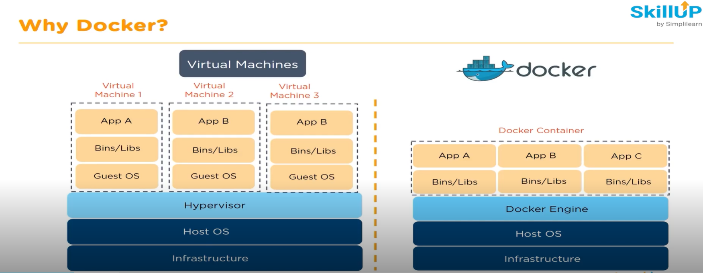

Docker is lightweight owing to absence of Guest OS(which is present in VM)

Easy to scale and setup

Easy portability

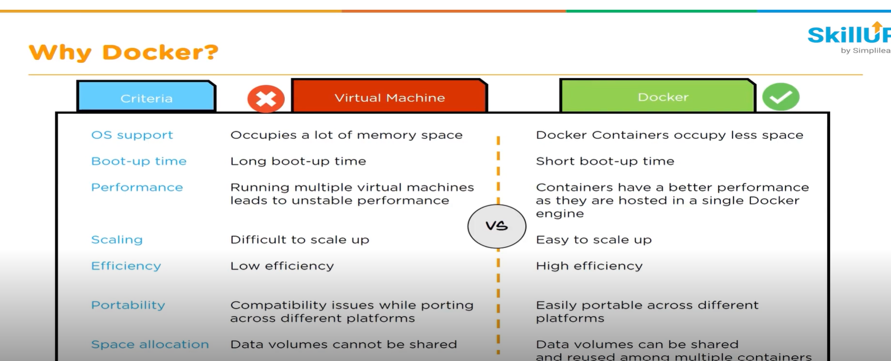

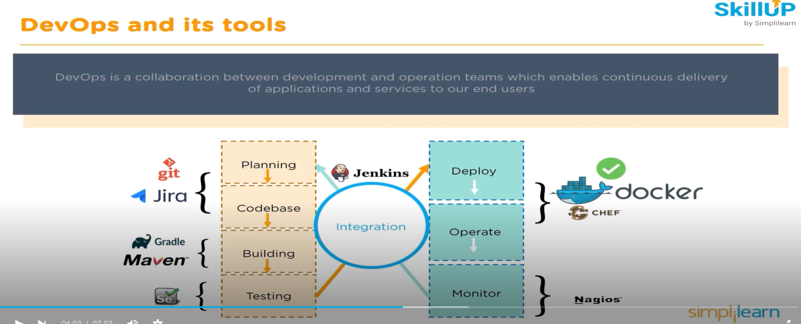

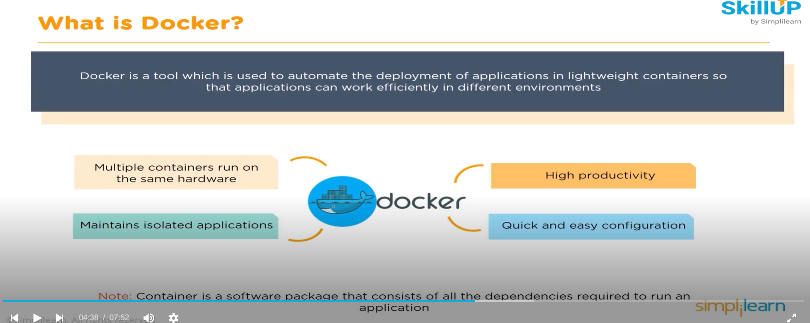
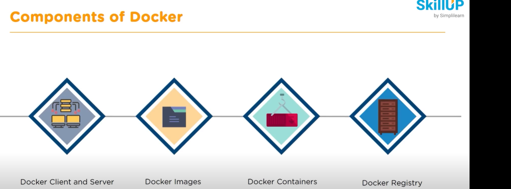
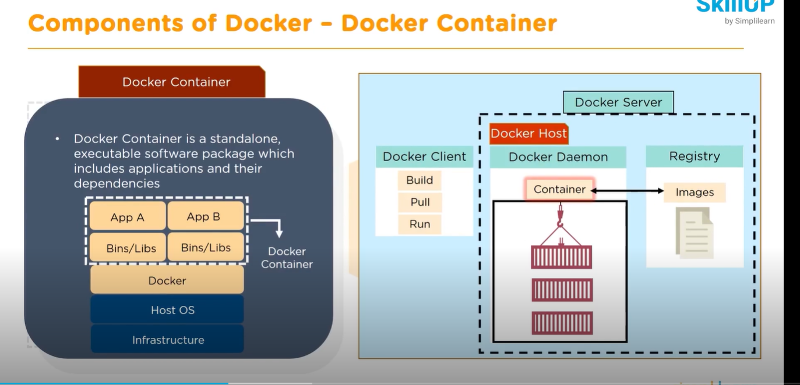

Docker container is a standalone,executable software package

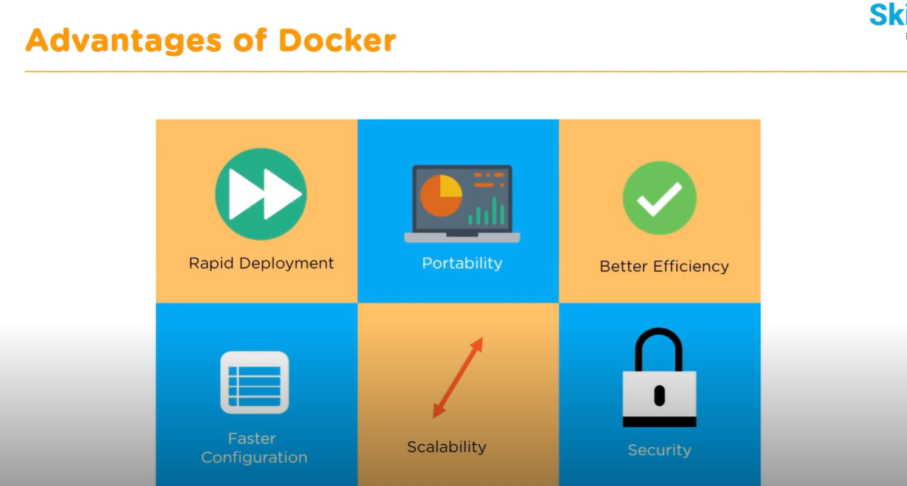
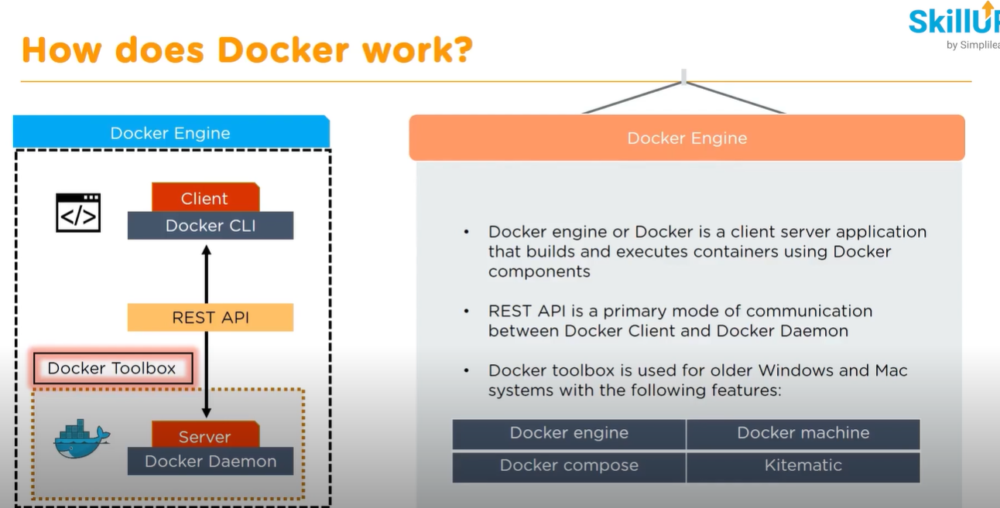
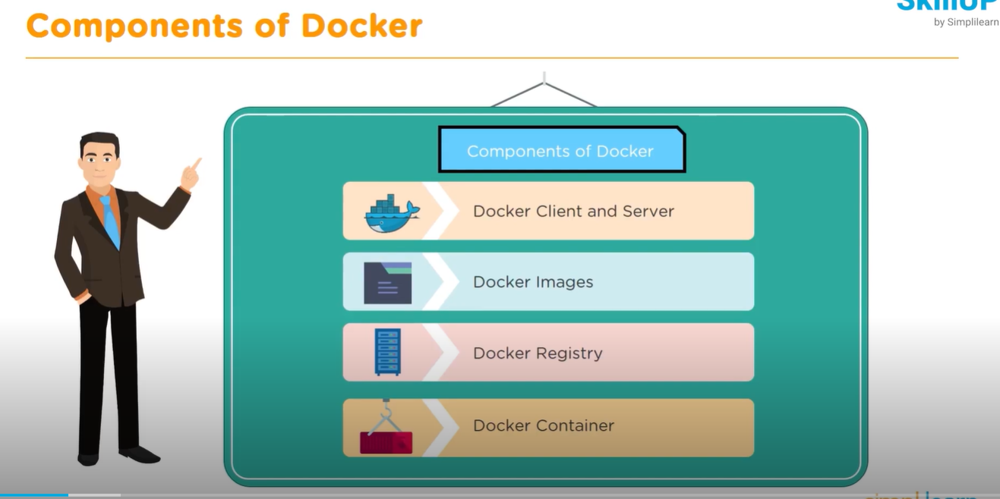
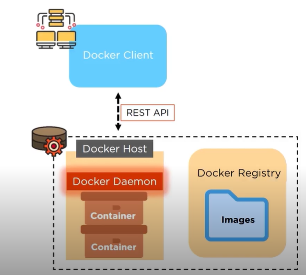'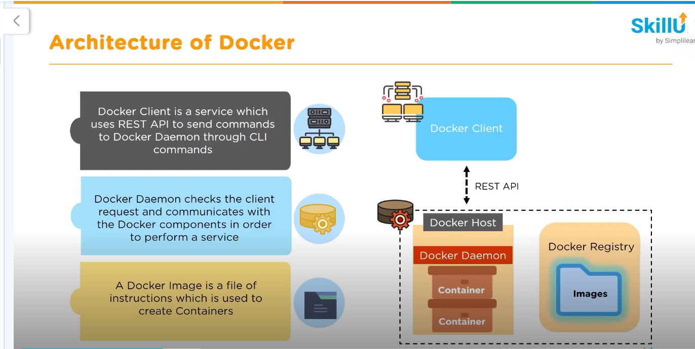'

docker compose up -d

docker compose shutdown

docker compose -f docker-compose2.yaml up -d

docker swarm init
docker swarm leave --force

Docker Swarm = orchestration tool for managing many Docker containers at scale.
